# General-Purpose Circuit Dependencies & Build Order

See [spacetime_circuits_dependency.md](spacetime_circuits_dependency.md)
for the spacetime-research-specific tiers (field/gravitation sensor
interfaces, HV pulse generation, calorimetric/energy measurement) that
build on the foundation below.

```mermaid
graph TD
    subgraph safety ["[SAFETY] Monitoring & Protection Circuits"]
        THERM["Thermal Monitoring with Alarm Threshold"]
        LEAKDET["AC Leakage Current Detector / Ground Fault"]
        GFCI["GFCI Trip Detection Circuit"]
        ESDMON["ESD Event Detector"]
        INSMON["Insulation Resistance Monitor"]
        ARCDECT["Arc Detection Circuit (high-voltage)"]
        OVERCUR["Overcurrent Sensor & Alert"]
        OVERVOLT["Overvoltage Monitor & Shutdown Signal"]
        TEMPCOIL["Component-Level Thermal Overload Sensor"]
        EMSTOP["Emergency Stop Circuit Status"]
        PSUHEALTH["Power Supply Health Monitor"]
        FUSESTAT["Fuse/Circuit Breaker Status Indicator"]
        RFRAD["RF Radiation Level Detector"]
        VACPRES["Vacuum Chamber Pressure Monitor"]
        SMOKDET["Smoke/Flame Detector Interface"]
    end

    subgraph psu_system ["Power Supply System (Tiered by Load)"]
        subgraph psu_pico_rail_g ["Pico rail: 3.3V, ~100mA conservative budget (bootstrap, interim)"]
            PSUPICO["Pico onboard 3V3(OUT) regulator (power_supplies/psu_pico_rail/) — built & bench-tested 2026-08"]
        end

        subgraph psu_ultralow ["Ultra-Low v1: 1.5V, ~100mA, &lt;0.15W (Bootstrap) — power_supplies/psu_ultralow_v1/ — built & bench-tested 2026-08-30"]
            PSUUL["Single AA Battery (Alkaline) — Version 1"]
            PROTUL["Polyfuse (50mA, slow-blow) — all 20 RXEF005 units validated PASS via measurement_tools/ammeter_10ohm/"]
        end
        
        subgraph psu_low ["Low (v2 Upgrade): 3.0V, &lt;300mA, ~0.9W — power_supplies/psu_low_v2/"]
            PSULOW["2xAA Battery Holder in Series"]
            PROTLOW["Polyfuse (500mA) + Series Schottky Diode — all 20 RXEF050 units validated PASS via measurement_tools/ammeter_1ohm/"]
        end

        subgraph psu_3aa ["4.5V, &lt;300mA, ~1.2W — power_supplies/psu_3xaa/"]
            PSU3AA["3xAA Battery Holder in Series"]
            PROT3AA["Polyfuse (500mA) + Series Schottky Diode"]
        end

        subgraph psu_4aa ["6.0V, &lt;300mA, ~1.6W — power_supplies/psu_4xaa/"]
            PSU4AA["4xAA Battery Holder in Series"]
            PROT4AA["Polyfuse (500mA) + Series Schottky Diode"]
        end
        
        subgraph psu_medlow ["Medium: 5V USB + Regulator OR 12V, 1–3A, 5–36W"]
            PSUMEDLOW["USB Wall Adapter (5V 3A) OR 12V Sabrent USB-C Adapter"]
            PSUMEDLOWLM317["SFE Breadboard Power Supply Kit (LM317 adjustable, 3.3V/5V-selectable) — power_supplies/psu_medlow_lm317/ — on order, not yet built"]
            PROTMEDLOW["Fuse (2A fast-blow) + Polyfuse (500mA backup) for 12V path"]
        end
        
        subgraph psu_medhigh ["Medium-High: 9–20V, 2–3.25A, up to 65W"]
            PSUMEDHIGH["Lenovo 65W USB-C PD Adapter (20V/3.25A, 15V/3A, 9V/2A, 5V/2A)"]
            PROTMEDHIGH["Fuse (3A) + Electronic Current Limiter (MOSFET sense)"]
        end
        
        subgraph psu_high ["High: 48V+, Variable, 100W+"]
            PSUHIGH["Industrial Supply (external, future)"]
            PROTHIGH["Dedicated Electronic Active Limiter + Arc Detection"]
        end
    end

    subgraph protection ["Circuit Breaking & Protection (Passive)"]
        FUSE["Fuse: Ceramic/Glass Tube, Alloy Wire (100mA–5A)"]
        POLYFUSE["Polyfuse/PTC: Polymer Matrix, Resettable (50mA–2A)"]
        POLYSWITCH["Polyswitch: Polymer-Based, Different Thermal Curve"]
        ACTIVELIM["Active Current Limiter: MOSFET + Sense Resistor + Controller"]
    end

    subgraph bootstrap ["Bootstrap: Minimal-Cost Validation (Build First, No Off-Shelf Gear)"]
        PASSVM["Bootstrap DC Voltmeter — Pico ADC probe (measurement_tools/fuse_test_voltmeter/), no galvanometer build needed"]
        LEDIND["LED/Relay Presence Indicator"]
        SIMPLECNT["Basic Frequency Counter (555-gated or manual)"]
        TUNINGFK["Calibrated Tuning Fork Frequency Reference"]
        AUDIOSC["Audio-Input Oscilloscope (smartphone)"]
        CRTSC["Homemade CRT Oscilloscope"]
    end

    subgraph tier1 ["Tier 1: Foundational (Simplest, Low Cost)"]
        REF["Precision Reference Voltage Generator (3.3V or 5V input) — see signal_conditioning/voltage_reference_lm358/ — built & bench-tested 2026-08-27"]
        OSC["Precision Timing Oscillator (1.5–5V) — see oscillators/ne555_astable/ — designed & simulated 2026-09-01, not yet bench-built"]
        SIMPGEN["Simple Function Generator (5–12V input)"]
    end

    subgraph tier2 ["Tier 2: Essential Validation & Measurement"]
        VM["Precision DC Voltmeter"]
        AM["Precision Current Shunt Ammeter"]
        FREQC["Basic Frequency Counter"]
        TIA["Transimpedance Amplifier"]
    end

    subgraph tier3 ["Tier 3: Passive Components & Bridges"]
        OHMMETER["4-Wire Kelvin Ohmmeter"]
        CAPBRIDGE["Capacitance Bridge"]
        INDBRIDGE["Inductance Bridge"]
        TEMPCOMP["Temperature Compensation Circuit"]
    end

    subgraph tier4 ["Tier 4: Core Analog Signal Processing"]
        IA["Instrumentation Amplifier"]
        DA["Differential Amplifier"]
        PHASED["Phase Detector"]
        DEMOD["Synchronous Demodulator"]
    end

    subgraph tier6 ["Tier 6: Advanced Detection & Analysis"]
        LOCKIN["Lock-In Amplifier"]
        AAF["Anti-Aliasing Filter"]
        TIMEINT["Time Interval Measurement Circuit"]
        JITTER["Jitter Measurement Circuit"]
    end

    subgraph tier9 ["Tier 9: Data Acquisition & Integration"]
        SAMHOLD["Sample-and-Hold Circuit"]
        MUX["Analog Multiplexer with Buffer — see measurement_tools/cd4066_switch_tester/ for CD4066B bring-up"]
        ADCDRV["ADC Driver Circuit"]
        REFGEN2["Reference Distribution Circuit"]
    end

    subgraph concurrent_meas_tools ["Validation & Test Tools (Use Alongside Build)"]
        subgraph scope_tiers ["Scope/Logic-Analyzer Tiers, by Fidelity & Cost (don't buy the next tier until it actually blocks a circuit)"]
            SCOPEPICO["M0: Pico MicroPython — RP2040 12-bit ADC (0-3.3V only, software-timed via machine.ADC; measured noise floor &lt;5 counts/&lt;0.25mV with 100nF filter, see measurement_tools/gpio_analog_sensing/) + GPIO edge timing via ticks_us() in an ISR (sub-kHz to low-kHz reliable; PIO could go faster but nothing here programs it) — $0, on hand"]
            SCOPEPC["M1: Desktop PC (ROG Strix) onboard sound card as 2-ch AC-coupled scope+function-gen (Audacity/PulseView soundcard driver), 20Hz-20kHz, 16/24-bit — $0, on hand; needs a DC-blocking/attenuator buffer in front of line-in (AC-coupled, can't read DC); supersedes AUDIOSC in-band only"]
            SCOPEUSBSER["M2: Desktop PC + USB-serial adapter (CH340/FTDI), pyserial-bit-banged RTS/DTR — second PC-hosted digital channel independent of the Pico, cross-check only (still software-timed, ~100Hz-1kHz), not a capture instrument — ~$1-2, not yet purchased"]
            SCOPELA["M3: 8ch 24MHz USB Logic Analyzer + sigrok/PulseView — first tier with real hardware-timed sampling + triggering + I2C/SPI/UART decode — ~$5-8, not yet purchased"]
            SCOPEDSO["M4: DSO138 DIY analog scope kit, 200kHz/1MSa/s single-channel — first tier that captures actual analog waveform shape, not just edges; solder-it-yourself — ~$15-25, not yet purchased"]
            SCOPEBENCH["M5: Bench-grade mixed-signal scope/instrument — cost TBD, price only once tier7/8 RF/HV-pulse/lock-in work needs bandwidth or simultaneous analog+digital capture beyond M3/M4"]
        end
        PRECBOX["Precision Decade Box"]
        LOADBANK["Resistive Load Bank"]
        NOISEGEN["Precision Noise Source"]
        TESTSIG["Calibrated Test Signal Generator"]
        THERMOAMP["Thermocouple Amplifier"]
    end

    SPACETIME["Spacetime-specific tiers (5/7/8): field/gravitation sensor interfaces, HV pulse generation, calorimetric/energy measurement — see spacetime_circuits_dependency.md"]

    %% Pico rail feeds low-current bring-up work directly (interim, while
    %% wire strippers are in transit for psu_ultralow/psu_low)
    PSUPICO -.interim, ~100mA budget.-> tier1

    %% PSU upgrade path
    psu_ultralow -->|upgrade to| psu_low
    psu_low -->|upgrade to| psu_3aa
    psu_3aa -->|upgrade to| psu_4aa
    psu_4aa -->|upgrade to| psu_medlow
    
    %% PSU system feeds safety and tier 1
    psu_system --> safety
    psu_system --> tier1
    psu_system --> protection
    
    %% Protection feeds back to PSU layers
    FUSE -.required.-> psu_medlow
    FUSE -.required.-> psu_medhigh
    POLYFUSE -.required.-> psu_ultralow
    POLYFUSE -.required.-> psu_low
    POLYFUSE -.required.-> psu_3aa
    POLYFUSE -.required.-> psu_4aa
    POLYFUSE -.required.-> psu_medlow
    ACTIVELIM -.required.-> psu_medhigh
    ACTIVELIM -.required.-> psu_high
    POLYSWITCH -.alternative.-> psu_low
    POLYSWITCH -.alternative.-> psu_medlow
    PSUMEDLOWLM317 -.alternative.-> PSUMEDLOW
    
    %% Safety circuits depend on Tier 1 fundamentals
    REF --> safety
    
    %% Safety monitors feed into hazardous tiers — the hazardous/HV-facing
    %% ones (arc, overcurrent, overvoltage, RF, e-stop, component thermal)
    %% are spacetime-tier consumers; see spacetime_circuits_dependency.md
    THERM --> tier2
    SMOKDET --> tier2
    OVERCUR --> SPACETIME
    ARCDECT --> SPACETIME
    OVERVOLT --> SPACETIME
    RFRAD --> SPACETIME
    TEMPCOIL --> SPACETIME
    LEAKDET --> tier1
    INSMON --> tier3
    
    %% Safety interlock dependencies
    EMSTOP -.protective.-> SPACETIME
    GFCI -.protective.-> tier2
    FUSESTAT -.monitoring.-> psu_medlow

    %% Bootstrap breaks circular dependencies
    LEDIND --> psu_low
    PASSVM --> REF
    PASSVM --> psu_low
    SIMPLECNT --> OSC
    TUNINGFK --> OSC
    AUDIOSC --> SIMPGEN
    AUDIOSC --> REF
    CRTSC --> psu_low
    SIMPLECNT --> SIMPGEN

    %% Tier 1 dependencies
    REF --> tier2
    OSC --> tier2
    psu_low --> tier2
    psu_medlow --> tier2
    SIMPGEN --> tier2
    
    %% Bootstrap feeds into concurrent measurement tools
    PASSVM -.alternative.-> SCOPEPICO
    SIMPLECNT -.alternative.-> SCOPEPICO
    AUDIOSC -.superseded by.-> SCOPEPC
    TUNINGFK -.calibration.-> TESTSIG

    %% Scope/logic-analyzer tier progression (mirrors the PSU upgrade chain)
    SCOPEPICO -.parallel, independent channel.-> SCOPEPC
    SCOPEPC -->|upgrade to| SCOPEUSBSER
    SCOPEUSBSER -->|upgrade to| SCOPELA
    SCOPELA -->|upgrade to| SCOPEDSO
    SCOPEDSO -->|upgrade to| SCOPEBENCH

    %% Tier 2 supports tier 3
    VM --> tier3
    FREQC --> tier3
    AM --> tier3

    %% Tier 3 to tier 4
    OHMMETER --> tier4
    TEMPCOMP --> tier4

    %% Tier 4 building blocks — IA/DA/TIA feed spacetime-tier sensor work;
    %% PHASED/DEMOD stay general-purpose (tier6 lock-in/demodulation)
    IA --> SPACETIME
    DA --> SPACETIME
    PHASED --> tier6
    DEMOD --> tier4
    TIA --> SPACETIME

    %% Tier 6 advanced detection
    LOCKIN --> tier6
    PHASED --> LOCKIN
    OSC --> LOCKIN
    OSC --> SPACETIME
    AAF --> SPACETIME
    TIMEINT --> SPACETIME
    JITTER --> SPACETIME

    %% Data acquisition
    AAF --> SAMHOLD
    SAMHOLD --> MUX
    MUX --> ADCDRV
    REF --> REFGEN2

    %% Concurrent measurement tools connect to build process
    SCOPEPICO -.validation.-> tier1
    SCOPEPICO -.validation.-> tier2
    SCOPEPICO -.validation.-> safety
    SCOPEPC -.validation, AC/audio-band only.-> tier1
    SCOPEUSBSER -.independent x-check.-> SCOPEPICO
    SCOPELA -.validation.-> tier2
    SCOPELA -.validation.-> tier3
    SCOPELA -.validation.-> MUX
    SCOPEDSO -.validation.-> tier1
    SCOPEDSO -.validation.-> tier4
    SCOPEDSO -.ripple/noise check.-> psu_medlow
    SCOPEDSO -.ripple/noise check.-> psu_medhigh
    SCOPEBENCH -.required.-> SPACETIME
    PRECBOX -.calibration.-> tier3
    THERMOAMP -.validation.-> SPACETIME
    LOADBANK -.testing.-> SPACETIME
    NOISEGEN -.testing.-> SPACETIME
    TESTSIG -.verification.-> tier6

    %% pico/ repo circuits — optional alternatives, not dependencies (that
    %% repo stands alone as general-purpose Pico infrastructure)
    PICOADC["pico/measurement_tools/gpio_analog_sensing/"] -.optional alternative.-> ADCDRV
    PICOBTN["pico/buttons/gpio_button_timing/, gpio_interrupt_button/"] -.optional alternative.-> SIMPLECNT
    PICOLED["pico/leds/gpio_led_basic/"] -.optional alternative.-> LEDIND
    PICOPWM["pico/leds/gpio_pwm_led/ (planned)"] -.optional alternative.-> SIMPGEN

    style safety fill:#ffcccc,stroke:#cc0000,stroke-width:3px,color:#000
    style psu_system fill:#e8f5e9,stroke:#2e7d32,stroke-width:2px
    style psu_pico_rail_g fill:#fff9c4,stroke:#f9a825,stroke-width:2px
    style psu_ultralow fill:#e0f2f1,stroke:#00897b,stroke-width:2px
    style psu_low fill:#a5d6a7,stroke:#2e7d32,stroke-width:2px
    style psu_3aa fill:#96d19a,stroke:#2e7d32,stroke-width:2px
    style psu_4aa fill:#8ac98e,stroke:#2e7d32,stroke-width:2px
    style psu_medlow fill:#81c784,stroke:#2e7d32,stroke-width:2px
    style psu_medhigh fill:#66bb6a,stroke:#1b5e20,stroke-width:2px
    style psu_high fill:#4caf50
    style protection fill:#bbdefb,stroke:#1565c0,stroke-width:2px
    style bootstrap fill:#ffccbc,stroke:#e65100,stroke-width:2px
    style tier1 fill:#e1f5e1
    style tier2 fill:#e3f2fd
    style tier3 fill:#f3e5f5
    style tier4 fill:#fff3e0
    style tier6 fill:#f1f8e9
    style tier9 fill:#e0f2f1
    style concurrent_meas_tools fill:#fff9c4
    style scope_tiers fill:#fff59d,stroke:#f57f17,stroke-width:2px
    style SPACETIME fill:#f8bbd0,stroke:#ad1457,stroke-width:2px
    style PICOADC fill:#eeeeee,stroke:#616161,stroke-width:1px
    style PICOBTN fill:#eeeeee,stroke:#616161,stroke-width:1px
    style PICOLED fill:#eeeeee,stroke:#616161,stroke-width:1px
    style PICOPWM fill:#eeeeee,stroke:#616161,stroke-width:1px
```

