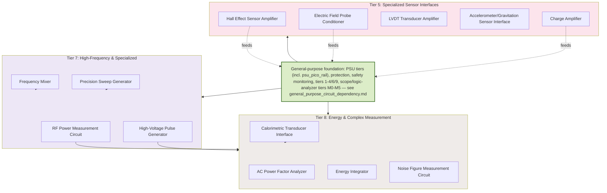

# Spacetime Research Circuit Dependencies & Build Order

Spacetime-research-specific circuits: gravitation/field sensor interfaces,
high-voltage pulse generation, and calorimetric/energy measurement, in
support of experiments toward faster-than-light travel. The specific
theory under test isn't fixed — this tier graph covers the
sensing/actuation/measurement building blocks any such experiment needs,
independent of which approach is being tested.
These build on the general-purpose foundation (PSU tiers, protection,
safety monitoring, tiers 1–4/6/9, scope/logic-analyzer tiers M0–M5) in
[general_purpose_circuit_dependency.md](general_purpose_circuit_dependency.md)
— see the `GENERAL` node below for exactly which upstream tiers feed in.

---

## Why these tiers — instrumentation drawn from published small-force/anomalous-thrust literature (2026-09-15)

A first-pass literature scan (peer-reviewed and arXiv sources covering three
independent published families of small-thrust claims: a high-voltage
capacitor/electrode family, a closed-cavity RF-power family, and a resonant
piezoelectric-stack family) surfaces a consistent instrumentation pattern
across all three, regardless of which family — or any other approach — is
ever tested downstream of this repo. None of the sources below is cited as
evidence *for* any effect; most report null results, and one attributes the
oldest of the three families' historical claims to a known aerodynamic
confound. They're cited purely for their **measurement apparatus**, which is
directly relevant to this bench's tier5–8 nodes independent of whether any
tested phenomenon turns out to be real:

- **Precision force/displacement readout is the common backbone across all
  three families.** Published apparatus ranges from knife-edge beam balances
  to torsion pendulums with capacitive displacement sensors, resolving forces
  from tens of nanonewtons to about a micronewton (see:
  https://pubs.aip.org/aip/rsi/article/93/7/074502/2849025,
  https://www.researchgate.net/publication/257347959). This is the strongest
  available justification for tier5 `LVDTAMP` — currently the only tier5 node
  with zero hardware sourced — as a hobbyist-scale stand-in for the
  capacitive/inductive displacement sensors these published force balances
  actually use, at many orders of magnitude coarser resolution (this bench's
  Pico-ADC ceiling is nowhere near nN; that gap is expected, since
  equipment-building, not publishable measurement, is this repo's own scope
  — see `kb/circuit_lifecycle_and_repo_scope.md`).
- **Thermal-drift and calorimetric artifact rejection is the single most
  repeated methodology note across all three families.** Published designs
  include mechanical arrangements specifically built to cancel thermal drift,
  with explicit warnings that significant thermal/mechanical loads and high
  electric currents create false-positive force readings (see:
  https://d-nb.info/1244138614/34). Direct justification for tier8 `CALORIF`
  (and the already-built safety `THERM`) as **artifact-rejection**
  instruments, not generic energy measurement — the point of calorimetry
  here is proving a measured force isn't a thermal-expansion or convective
  artifact.
- **RF power measurement and frequency sweeping is central to the
  closed-cavity family.** Published protocols sweep a drive frequency to
  find cavity resonances and compute thrust-per-watt against classical
  radiation-pressure limits (see: https://arc.aiaa.org/doi/10.2514/1.B36120,
  https://arxiv.org/pdf/1706.04999). Direct justification for tier7 `RFPWR`
  and `SWEEP`.
- **A precisely phase-controlled pair of drive signals is central to the
  resonant piezoelectric-stack family** — published descriptions state both
  halves of the drive must hold a specific relative phase to produce any
  response, with devices frequency-swept to find the operating point with
  the largest response (see:
  https://www.researchgate.net/publication/234077543). This is the strongest
  single justification found for tier6 `LOCKIN`: synchronous (lock-in)
  detection at a known drive frequency is the standard technique for pulling
  a tiny periodic force signal out of noise in exactly this kind of setup,
  and it's the natural next stage downstream of `PHASED` (already built) and
  `EPFIELD`/`CHGAMP` (already bench-tested) — not just a generically useful
  DSP block.
- **Ion/corona-wind characterization is a named confound specifically for
  the high-voltage capacitor/electrode family** — mainstream analysis
  attributes most or all of that family's historical thrust claims to this
  aerodynamic effect (see: https://arxiv.org/pdf/1011.1393). Particle-image
  velocimetry and electrostatic-probe techniques are used to characterize it
  directly, which is functionally what `EPFIELD` already does (sense a
  local field/charge) — giving that circuit a second concrete role: not just
  detecting a target effect, but ruling out this specific confound in any
  high-voltage test setup, wherever a future experiment repo runs one.

**What this doesn't change**: none of the above adds a new tier-graph node
or changes any existing node's SPICE/breadboard design — it adds a sourced,
functional "why" to nodes that already existed with only a generic
tier-label rationale (`LVDTAMP`, `CALORIF`, `RFPWR`, `SWEEP`, `LOCKIN`,
`EPFIELD`). One real gap this scan surfaced and does *not* paper over:
**a dedicated precision force/displacement-balance readout isn't itself a
named node anywhere in this graph** — `LVDTAMP` is the closest fit (an LVDT
is one real way to instrument a beam/pendulum's displacement) but a torsion-
or beam-balance mechanical structure itself has no node. Not added here
since that's a structural graph change, not a rationale addition — flagged
in `TODO-arcticoder.md`'s Backlog section for a human decision on whether
it's worth a new node. See `docs/kb/spacetime_sensor_chain_notes.md` for
this literature scan's fuller session notes, kept separate from this
current-state document.
