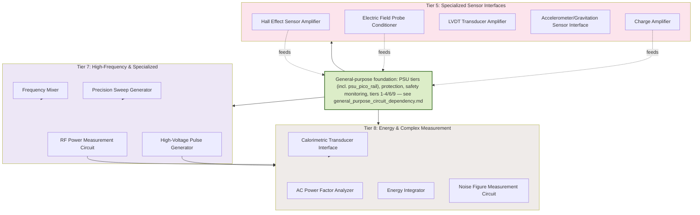

# Spacetime Research Circuit Dependencies & Build Order

Spacetime-research-specific circuits: gravitation/field sensor interfaces,
high-voltage pulse generation, and calorimetric/energy measurement for
electrogravitics (Biefeld-Brown effect) and Woodward-effect experiments.
These build on the general-purpose foundation (PSU tiers, protection,
safety monitoring, tiers 1–4/6/9) in
[general_purpose_circuit_dependency.md](general_purpose_circuit_dependency.md)
— see the `GENERAL` node below for exactly which upstream tiers feed in.

