# Spacetime Research Circuit Dependencies & Build Order

Spacetime-research-specific circuits: gravitation/field sensor interfaces,
high-voltage pulse generation, calorimetric/energy measurement,
precision force/displacement-balance readout, particle/photon-counting
timing, and optical-source (laser/LED) driving for interferometric and
displacement-sensing chains — in support of experiments toward
faster-than-light travel. The specific theory under test isn't fixed —
this tier graph covers the sensing/actuation/measurement building blocks
any such experiment needs, independent of which approach is being
tested.
These build on the general-purpose foundation (PSU tiers, protection,
safety monitoring, tiers 1–4/6/9, scope/logic-analyzer tiers M0–M5) in
[general_purpose_circuit_dependency.md](general_purpose_circuit_dependency.md)
— see the `GENERAL` node below for exactly which upstream tiers feed in.
A small set of mechanical/optical build objectives that aren't circuits
in their own right (vibration isolation, an analog-gravity ripple tank)
but that the electronic tiers below directly serve or depend on are also
included — see the `mech` subgraph.

```mermaid
graph TD
    subgraph tier5 ["Tier 5: Specialized Sensor Interfaces"]
        HALLAMP["Hall Effect Sensor Amplifier"]
        EPFIELD["Electric Field Probe Conditioner"]
        LVDTAMP["LVDT Transducer Amplifier"]
        %% status: designed/simulated 2026-09-23 (signal_conditioning/accelerometer_interface/), not built
        ACCELIF["Accelerometer/Gravitation Sensor Interface"]
        CHGAMP["Charge Amplifier"]
        %% added 2026-09-18 — resolves the force/displacement-balance gap
        %% flagged 2026-09-15; see "Why these new tiers" below
        FORCEBAL["Torsion/Beam-Balance Displacement Readout (capacitive- or LVDT-sensed)"]
        %% added 2026-09-18 — new sensing modality, not covered by any
        %% existing tier5 node (photon/particle-counting, not analog)
        SIPMFE["SiPM/Scintillator Particle-Counting Front-End (bias + pulse-shaping)"]
    end

    subgraph tier7 ["Tier 7: High-Frequency & Specialized"]
        RFPWR["RF Power Measurement Circuit"]
        MIXER["Frequency Mixer"]
        SWEEP["Precision Sweep Generator"]
        HVPULSE["High-Voltage Pulse Generator"]
        %% added 2026-09-18 — shared optical-source building block for
        %% FORCEBAL (radiation-pressure drive), and for the optical-lever/
        %% interferometer/fiber-loop sensing chains built from GENERAL's
        %% TIA/DA (see "Why these new tiers" below)
        LASERDRV["Constant-Current Optical Source Driver (LED or laser diode)"]
    end

    subgraph tier8 ["Tier 8: Energy & Complex Measurement"]
        CALORIF["Calorimetric Transducer Interface"]
        PWRFACT["AC Power Factor Analyzer"]
        ENGINT["Energy Integrator"]
        NOISEFIG["Noise Figure Measurement Circuit"]
    end

    %% added 2026-09-18 — mechanical/optical build objectives named in
    %% experimental-validation literature that aren't circuits themselves
    %% but that tier5/7 nodes above directly depend on or drive; see
    %% "Why these new tiers" below. Not file-creation work for TODO-agent.md
    %% the way a circuit is — no netlist/smoke_test applies to these two.
    subgraph mech ["Mechanical/Optical Build Objectives (non-circuit)"]
        VIBISO["Vibration/Seismic Isolation Platform"]
        RIPPLETANK["2D Ripple Tank, Variable-Depth Topography"]
    end

    GENERAL["General-purpose foundation: PSU tiers (incl. psu_pico_rail), protection, safety monitoring, tiers 1-4/6/9, scope/logic-analyzer tiers M0-M5 — see general_purpose_circuit_dependency.md"]

    %% Upstream foundation feeds every spacetime-specific tier
    GENERAL --> tier5
    GENERAL --> tier7
    GENERAL --> tier8

    %% Tier 5 sensor interfaces feed general-purpose tier 6 processing
    %% (lock-in amp, anti-aliasing filter — reusable beyond spacetime work)
    HALLAMP -.feeds.-> GENERAL
    EPFIELD -.feeds.-> GENERAL
    CHGAMP -.feeds.-> GENERAL
    %% weak displacement signal needs tier4/6 amplification, same role as
    %% the three feeds above
    FORCEBAL -.feeds.-> GENERAL
    %% pulse timing consumed by tier6 TIMEINT/JITTER (already-named
    %% general-purpose nodes, both still undesigned)
    SIPMFE -.feeds.-> GENERAL

    %% Tier 7 specialized
    MIXER --> tier7
    SWEEP --> tier7
    RFPWR --> tier8

    %% Higher tiers
    HVPULSE --> tier8
    CALORIF --> tier8

    %% LASERDRV's own output isn't sensed directly — it drives a photodiode
    %% (GENERAL's tier2 TIA, already built & bench-tested) and/or a torsion
    %% balance (FORCEBAL, radiation-pressure-driven variant)
    LASERDRV -.optical source for.-> FORCEBAL
    LASERDRV -.drives photodiode front-end in.-> GENERAL

    %% LVDTAMP is one real way to instrument FORCEBAL's displacement
    %% (capacitive sensing is the other, see "Why these new tiers" below)
    LVDTAMP -.can instrument.-> FORCEBAL

    %% Mechanical prerequisites — vibration sensitivity affects both the
    %% torsion balance and any optical-lever/interferometer/fiber-loop work
    VIBISO -.mechanical prerequisite.-> FORCEBAL
    VIBISO -.mechanical prerequisite.-> LASERDRV

    %% Ripple tank: general-purpose supplies the wave driver (tier1
    %% SIMPGEN) and consumes its phase-shifted output (tier4/6
    %% PHASED/LOCKIN) — same bidirectional relationship as the tier5
    %% -.feeds.-> GENERAL edges above, just for a mechanical node
    GENERAL --> RIPPLETANK
    RIPPLETANK -.feeds.-> GENERAL

    style tier5 fill:#fce4ec
    style tier7 fill:#ede7f6
    style tier8 fill:#efebe9
    style mech fill:#fff8e1,stroke:#f9a825,stroke-width:2px,stroke-dasharray: 4 3
    style GENERAL fill:#dcedc8,stroke:#33691e,stroke-width:2px
```

---

## Why these tiers — instrumentation drawn from published small-force/anomalous-thrust literature (2026-09-15)

A first-pass literature scan (peer-reviewed and arXiv sources covering three
independent published families of small-thrust claims: a high-voltage
capacitor/electrode family, a closed-cavity RF-power family, and a resonant
piezoelectric-stack family) surfaces a consistent instrumentation pattern
across all three, regardless of which family — or any other approach — is
ever tested downstream of this repo. None of the sources below is cited as
evidence *for* any effect; most report null results, and one attributes the
oldest of the three families' historical claims to a known aerodynamic
confound. They're cited purely for their **measurement apparatus**, which is
directly relevant to this bench's tier5–8 nodes independent of whether any
tested phenomenon turns out to be real:

- **Precision force/displacement readout is the common backbone across all
  three families.** Published apparatus ranges from knife-edge beam balances
  to torsion pendulums with capacitive displacement sensors, resolving forces
  from tens of nanonewtons to about a micronewton (see:
  https://pubs.aip.org/aip/rsi/article/93/7/074502/2849025,
  https://www.researchgate.net/publication/257347959). This is the strongest
  available justification for tier5 `LVDTAMP` — currently the only tier5 node
  with zero hardware sourced — as a hobbyist-scale stand-in for the
  capacitive/inductive displacement sensors these published force balances
  actually use, at many orders of magnitude coarser resolution (this bench's
  Pico-ADC ceiling is nowhere near nN; that gap is expected, since
  equipment-building, not publishable measurement, is this repo's own scope
  — see `kb/circuit_lifecycle_and_repo_scope.md`).
- **Thermal-drift and calorimetric artifact rejection is the single most
  repeated methodology note across all three families.** Published designs
  include mechanical arrangements specifically built to cancel thermal drift,
  with explicit warnings that significant thermal/mechanical loads and high
  electric currents create false-positive force readings (see:
  https://d-nb.info/1244138614/34). Direct justification for tier8 `CALORIF`
  (and the already-built safety `THERM`) as **artifact-rejection**
  instruments, not generic energy measurement — the point of calorimetry
  here is proving a measured force isn't a thermal-expansion or convective
  artifact.
- **RF power measurement and frequency sweeping is central to the
  closed-cavity family.** Published protocols sweep a drive frequency to
  find cavity resonances and compute thrust-per-watt against classical
  radiation-pressure limits (see: https://arc.aiaa.org/doi/10.2514/1.B36120,
  https://arxiv.org/pdf/1706.04999). Direct justification for tier7 `RFPWR`
  and `SWEEP`.
- **A precisely phase-controlled pair of drive signals is central to the
  resonant piezoelectric-stack family** — published descriptions state both
  halves of the drive must hold a specific relative phase to produce any
  response, with devices frequency-swept to find the operating point with
  the largest response (see:
  https://www.researchgate.net/publication/234077543). This is the strongest
  single justification found for tier6 `LOCKIN`: synchronous (lock-in)
  detection at a known drive frequency is the standard technique for pulling
  a tiny periodic force signal out of noise in exactly this kind of setup,
  and it's the natural next stage downstream of `PHASED` (already built) and
  `EPFIELD`/`CHGAMP` (already bench-tested) — not just a generically useful
  DSP block.
- **Ion/corona-wind characterization is a named confound specifically for
  the high-voltage capacitor/electrode family** — mainstream analysis
  attributes most or all of that family's historical thrust claims to this
  aerodynamic effect (see: https://arxiv.org/pdf/1011.1393). Particle-image
  velocimetry and electrostatic-probe techniques are used to characterize it
  directly, which is functionally what `EPFIELD` already does (sense a
  local field/charge) — giving that circuit a second concrete role: not just
  detecting a target effect, but ruling out this specific confound in any
  high-voltage test setup, wherever a future experiment repo runs one.

**What this didn't change, as of the 2026-09-15 pass itself**: none of the
above added a new tier-graph node or changed any existing node's
SPICE/breadboard design — it added a sourced, functional "why" to nodes
that already existed with only a generic tier-label rationale (`LVDTAMP`,
`CALORIF`, `RFPWR`, `SWEEP`, `LOCKIN`, `EPFIELD`). One real gap that scan
surfaced and did *not* paper over: a dedicated precision
force/displacement-balance readout wasn't itself a named node anywhere in
this graph — `LVDTAMP` was the closest fit (an LVDT is one real way to
instrument a beam/pendulum's displacement) but a torsion- or beam-balance
mechanical structure itself had no node. **Resolved 2026-09-18 — see the
next section**: `FORCEBAL` was added to close this gap, at the user's
explicit direction after a second literature pass (below) independently
converged on the same requirement from a different experimental-validation
angle. See `docs/kb/spacetime_sensor_chain_notes.md` for both literature
scans' fuller session notes, kept separate from this current-state
document.

## Why these new tiers — instrumentation drawn from real gravitational/optical experimental-validation literature (2026-09-18)

A second literature pass, working from a document surveying the current
(September 2026) state of spacetime-geometry research and its proposed
experimental-validation paths, surfaced several apparatus classes this
bench had no node for at all — not a refinement of existing tier5/7/8
rationale like the 2026-09-15 pass above, but genuinely new sensing/
actuation modalities. As with that pass: **none of the sources below is
cited as evidence for any specific spacetime theory or geometry** — they're
cited purely for their **measurement apparatus**, and no theory, program,
or researcher name appears in this section on purpose (see
`kb/repo_docs_conventions.md`'s "Don't name a specific fringe/exotic-physics
theory" entry). Several of the source document's own proposed validation
paths are **explicitly out of scope for this repo** — anything that's pure
software (numerical-relativity simulation, machine-learning geometry
search, public gravitational-wave-observatory data analysis) doesn't need
a circuit at all and belongs to whatever repo already does that
computational work, not this one; see
`docs/kb/spacetime_sensor_chain_notes.md` for the full list of excluded
items and why.

- **A macroscopic torsion balance driven by continuous radiation pressure
  from an off-the-shelf high-power LED or laser is a proposed way to
  characterize photon-recoil momentum transfer and steering-torque limits
  without exotic propellant** (see:
  https://opg.optica.org/josa/abstract.cfm?uri=josa-11-2-135,
  https://arxiv.org/html/2504.18789v1). This is direct justification for
  the new tier5 `FORCEBAL` node (the torsion/beam-balance structure itself,
  closing the gap flagged in the 2026-09-15 section above) and the new
  tier7 `LASERDRV` node (a constant-current driver for the LED or laser
  diode providing the radiation-pressure source) — a matching
  instrumentation requirement to the small-force/anomalous-thrust
  literature's torsion-pendulum apparatus already cited above, arrived at
  independently from a different experimental-validation angle.
- **A torsion pendulum built with spin-polarized (but externally
  unmagnetized) ferromagnetic material, with magnetic shielding and
  vibration isolation, is a proposed way to search for anomalous
  non-magnetic spin-spin coupling between macroscopic test masses** —
  same `FORCEBAL` mechanical structure as above, and gives the `HALLAMP`
  node (tier5, Hall-effect sensor amplifier — still backlog, needs a
  linear/analog Hall sensor per `TODO-arcticoder.md`'s "Next AliExpress
  order" section) a second concrete role once built: confirming a
  shielded core is actually net-zero external field before trusting a
  null result from the balance, not just generic field-sensing. Direct
  justification for the new `mech` subgraph's
  `VIBISO` (vibration/seismic isolation platform) node — this bench's
  ordinary tabletop is not vibration-isolated, and every apparatus in this
  section needs it.
- **Cosmic-ray muon detection with a low-voltage silicon photomultiplier
  (SiPM) coupled to a plastic scintillator paddle, with GPS-disciplined
  event timestamping, is a standard low-cost apparatus for feeding
  distributed timing-anomaly search networks** (see:
  https://physicsopenlab.org/2016/01/04/scintillation-muons-detector/,
  https://content.redpitaya.com/blog/diy-muon-telescope-rp,
  https://www.rs-online.com/designspark/building-a-cosmic-ray-detector-part-1-introduction-and-planning,
  https://arxiv.org/pdf/2312.02553). SiPM bias for hobbyist-scale modules
  runs roughly 24–30V DC (published designs commonly boost from a 5V rail)
  — comfortably under this bench's 50V DC high-voltage threshold (see
  `kb/circuit_lifecycle_and_repo_scope.md`). Direct justification for the
  new tier5 `SIPMFE` node (bias + pulse-shaping front-end); its pulse
  output is a natural driver for the already-named but still-undesigned
  general-purpose tier6 `TIMEINT`/`JITTER` nodes (coincidence timing
  between two paddles, and jitter in that timing), not a new consumer node.
- **A desktop optical interferometer (Michelson/Mach-Zehnder) or an
  optical-lever displacement sensor, built on a seismically isolated
  platform, is a proposed accessible way to build the exact skill set
  (vibration isolation, optical phase-shift measurement) used in
  macroscopic gravity-noise and gravity-gradient searches** (see:
  https://pmc.ncbi.nlm.nih.gov/articles/PMC10098680/,
  https://arxiv.org/pdf/1404.6722,
  https://www.researchgate.net/publication/228524868). This reuses
  already-built/already-named general-purpose nodes rather than adding new
  ones: a laser or LED source (new `LASERDRV`) illuminates a
  position-sensing photodiode pair, read out by the general-purpose tier2
  `TIA` (already built and bench-tested) feeding a tier4 `DA` differential
  stage (still undesigned) — no dedicated "position-sensing photodiode"
  node was added since `TIA`+`DA` already cover it functionally. `VIBISO` (above)
  is a direct mechanical prerequisite for this whole chain — an
  un-isolated optical bench will show vibration noise dwarfing any
  gravitational signal.
- **A fiber-optic loop with a low-power CW laser, routed through a
  deliberate feedback/self-interference path, is a proposed classical
  analog for studying phase-noise/instability accumulation** (see:
  https://arxiv.org/pdf/1212.5717, https://arxiv.org/pdf/0712.0740). Same
  `LASERDRV` + `TIA` + general-purpose tier6 `LOCKIN` chain as the
  interferometer bullet above — no new node needed beyond `LASERDRV`.
- **A 2D ripple tank with a variable-depth insert (a submerged sloped or
  stepped barrier) is the standard low-cost apparatus for visualizing wave
  refraction across a depth gradient**, and is the source document's own
  proposed apparatus for an "analog gravity" desk demonstration (see:
  https://spark.iop.org/refraction-ripples-entering-shallow-water,
  https://en.wikipedia.org/wiki/Ripple_tank). Direct justification for the
  new `mech` subgraph's `RIPPLETANK` node — a mechanical/hydrodynamic build,
  not a circuit, but one that reuses this bench's tier1 `SIMPGEN` (as its
  wave driver — `SIMPGEN` is itself still backlog/undesigned;
  `pico/leds/gpio_pwm_led/` in the sibling repo is its documented
  stand-in) and tier4/6 `PHASED`/`LOCKIN` (to read wavefront phase shift
  electronically instead of only by eye/strobe-light, the classic
  demonstration method) rather than needing any dedicated electronics of
  its own.

**What this does change, unlike the 2026-09-15 pass**: this *is* a
structural graph change — five new nodes (`FORCEBAL`, `SIPMFE`, `LASERDRV`,
`VIBISO`, `RIPPLETANK`) — done at the user's own explicit direction this
session, not a unilateral Claude decision (the 2026-09-15 pass's
"flag the gap, let the human decide" precedent still holds as the default;
this session is a stated exception, see `docs/history.md`). None of the
five have any hardware sourced yet — see `TODO-arcticoder.md`'s "Next
order" section for the resulting shopping list, and
`docs/kb/spacetime_sensor_chain_notes.md` for this pass's fuller session
notes, including the full list of source-document validation paths
deliberately excluded as software-only/out-of-scope.
